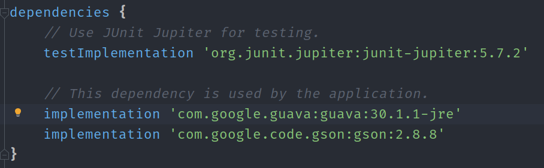

# Quotes

This file contain the 8th lab of java401d5 course.

and it contains:

1. **main** function which will read and parse a json file data using Gson and JsonReader and set those data into
   Class **Qoute** and the user have the option to choose between three option to print the qoute on the screen
2. **qouteByWord** method will take the whole qoutes list and filter it according if the qoute contain that specific
   word.
3. **qouteByAuthor** method will take the qoutes list and filter it according if the author is the same as entered by
   the user.
4. **Qoute** Class for storing and organize the quotes we read from the json file.

## Usage

> note that you have to implement the Gson library inside gradle project before running these command, to know how to import it click [here](#importing)

* For random qoute just type `$ gradle run` and it will print random qoute among the whole file.
* For random qoute from specific author (i.e "Charles") type `$ gradle run --args="author Charles"`
* For random qoute contains specific word (i.e "women") type `$ gradle run --args="contains women"`

### importing

1. open the project folder inside your preferred IDE then open file name "build.gradle"
2. copy and paste this line inside the dependencies in that folder "implementation 'com.google.code.gson:gson:2.8.8'"

